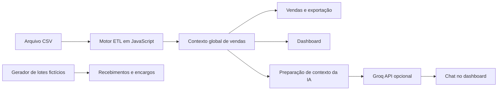

# ConciCred

Protótipo acadêmico de controladoria financeira para lojistas, desenvolvido por **Marcos Henrique da Silva** com Node-RED, JavaScript e integração com IA via Groq.

O projeto reúne importação de vendas em CSV, indicadores de faturamento, uma simulação de auditoria de recebimentos e um consultor por chat. Sua evolução começou com modelagem de processos, casos de uso e telas no Canva, avançando para uma aplicação web construída dentro dos fluxos do Node-RED.

**Estado do projeto:** demonstração acadêmica local. O módulo de recebimentos usa dados gerados pelo próprio código; o consultor contém referências fixas da apresentação original. Consulte as [limitações](docs/LIMITACOES.md) antes de interpretar resultados ou usar outros dados.

## Problema e proposta

Conferir vendas, taxas e recebimentos em planilhas separadas dificulta a visão financeira de uma loja. A proposta do ConciCred é reunir essas informações em uma interface que ajude o proprietário, a consultoria e a contabilidade a acompanhar o negócio.

O protótipo permite demonstrar o caminho de um arquivo de vendas até os indicadores e explorar como um modelo de linguagem pode explicar métricas previamente calculadas em JavaScript. Ganhos de produtividade descritos nos trabalhos acadêmicos são objetivos do projeto, sem medição quantitativa comprovada neste repositório.

## O que está implementado

| Módulo | Comportamento da versão publicada |
| --- | --- |
| Login | Quatro contas demonstrativas e redirecionamento ao menu; não constitui autenticação segura |
| Vendas | Importação de CSV, normalização, filtros, ordenação, totais e exportação da tabela |
| Dashboard | Indicadores calculados sobre as vendas e gráficos com Chart.js |
| Recebimentos | Geração de lotes fictícios, validação, reversão e gerenciamento de encargos |
| Consultor IA | Preparação de contexto, chamada HTTP à Groq e apresentação da resposta no dashboard |
| Suporte | Página ilustrativa, com contatos de exemplo |

Integração com bancos, TEF e adquirentes, cadastro efetivo de usuários e permissões por perfil fazem parte da modelagem/evolução desejada, não de integrações concluídas.

## Fluxo de funcionamento



Os lotes de recebimentos não são derivados do CSV nesta versão.

## Começar

1. Tenha Node-RED instalado em um ambiente local de testes.
2. Importe **somente** [`flows/concicred.json`](flows/concicred.json) pelo menu **Importar** do editor.
3. Clique em **Deploy / Implementar**.
4. Abra `http://localhost:1880/login`.
5. Entre com `administrador@teste.com` e senha demonstrativa `123456`.
6. Em **Vendas**, importe [`examples/vendas-demo.csv`](examples/vendas-demo.csv).

Para uma demonstração maior, use [`examples/vendas-750.csv`](examples/vendas-750.csv): são 750 vendas fictícias fornecidas pelo autor, com o formato normalizado para o motor. A [revisão do CSV](docs/REVISAO-CSV.md) explica a conversão e as divergências financeiras preservadas nos dados.

O guia de [instalação](docs/INSTALACAO.md) explica isolamento local e configuração opcional da IA. O [roteiro de demonstração](docs/DEMONSTRACAO.md) apresenta os resultados esperados do CSV.

Não importe diferentes versões do projeto na mesma instância: elas repetem rotas HTTP.

## Do protótipo ao sistema

Esta tela representa a etapa inicial de desenho da interface, não uma captura da execução atual:


Veja a [evolução das telas e processos](docs/PROTOTIPAGEM.md), os [casos de uso](docs/diagramas/casos-de-uso.pdf), o [modelo de classes](docs/diagramas/classes.pdf) e o [contexto C4](docs/diagramas/contexto-c4.pdf).

## Organização do repositório

```text
concicred/
├── README.md
├── CHANGELOG.md
├── SECURITY.md
├── .gitignore
├── settings.demo.js          # Configuração para instância local isolada
├── flows/concicred.json      # Aplicação completa importável
├── examples/                # Exemplo pequeno e massa fictícia de 750 vendas
├── scripts/preparar_csv.py  # Conversão da exportação para o formato do motor
├── docs/                    # Guias, arquitetura e histórico
│   ├── imagens/             # Telas do protótipo inicial
│   └── diagramas/           # Modelagem acadêmica
└── tests/validar.cjs         # Verificações locais sem chamar a IA
```

## Documentação

- [Instalação e configuração](docs/INSTALACAO.md)
- [Arquitetura, rotas e memória](docs/ARQUITETURA.md)
- [Formato do CSV e regras de transformação](docs/DADOS.md)
- [Revisão da massa de 750 vendas](docs/REVISAO-CSV.md)
- [Integração com IA e engenharia de prompt](docs/IA.md)
- [Prototipagem e evolução](docs/PROTOTIPAGEM.md)
- [Limitações e próximos desenvolvimentos](docs/LIMITACOES.md)
- [Demonstração e validação](docs/DEMONSTRACAO.md)
- [Como publicar no GitHub](docs/PUBLICACAO.md)
- [Origem dos arquivos e adaptações](docs/ORIGEM.md)

## Verificação local

Com Node.js instalado, execute na pasta do projeto:

```bash
node tests/validar.cjs
```

O teste verifica o JSON, referências entre nós e funções do motor com dados fictícios. Não envia dados para a Groq. As verificações não equivalem a uma certificação de segurança ou de correção financeira.

Verificações de funções e requisições HTTP locais realizadas com **Node-RED 5.0.7 e Node.js 24.21.0**, sem chave da Groq. Não foi validada uma chamada autenticada ao provedor nem a renderização visual completa em diferentes navegadores.

## Autoria e contexto acadêmico

**Marcos Henrique da Silva** — [GitHub MarcoH450](https://github.com/MarcoH450).

Projeto desenvolvido no curso de Análise e Desenvolvimento de Sistemas da Universidade Positivo, envolvendo Prototipagem de Sistemas Computacionais e Engenharia de Prompt e Integração com IA. A documentação registra o trabalho acadêmico e as diferenças encontradas entre planejamento e implementação.

## Licença

Este projeto é distribuído sob a licença MIT. Consulte o arquivo `LICENSE` do repositório. As tecnologias e bibliotecas utilizadas mantêm suas próprias licenças.
