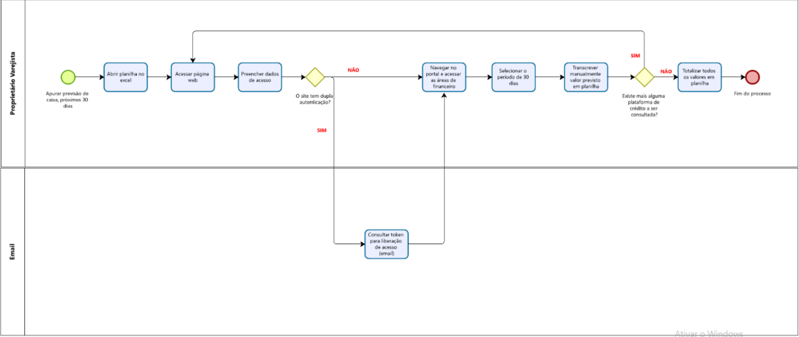
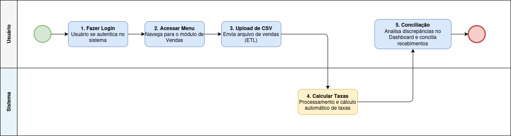
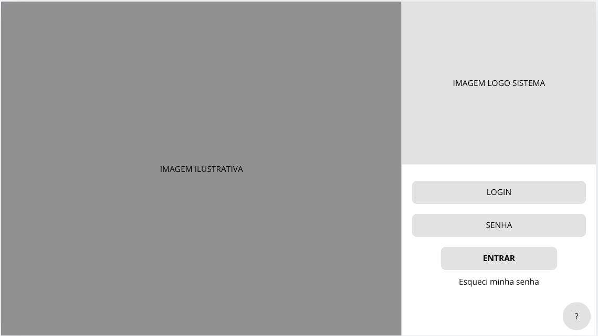
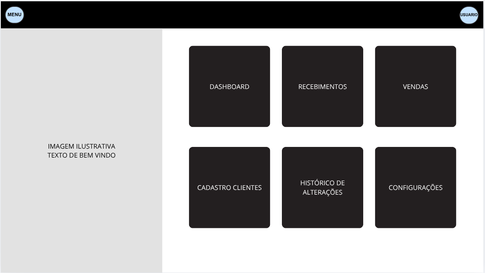
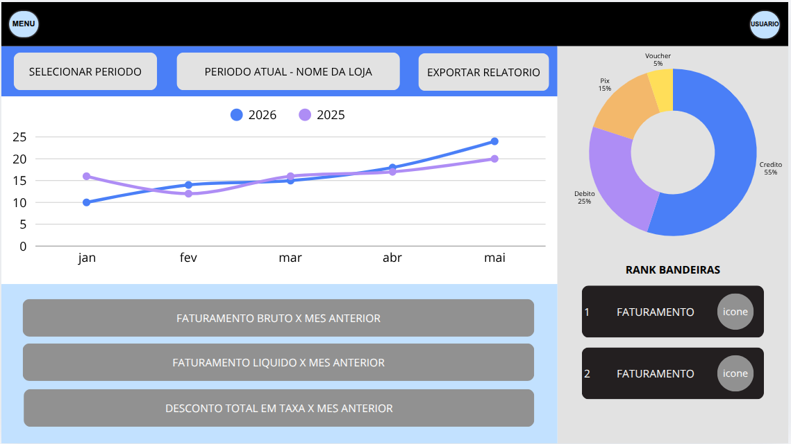
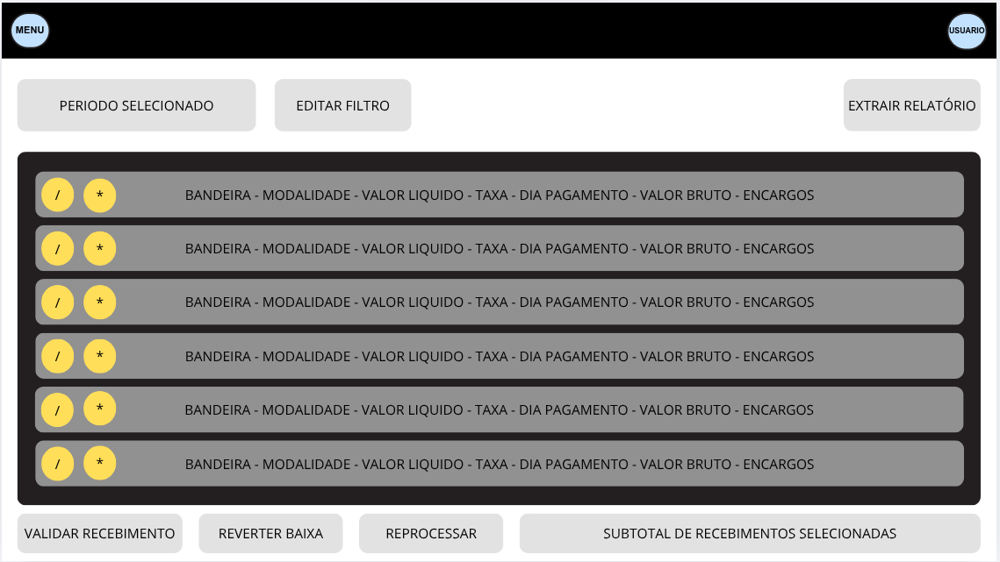
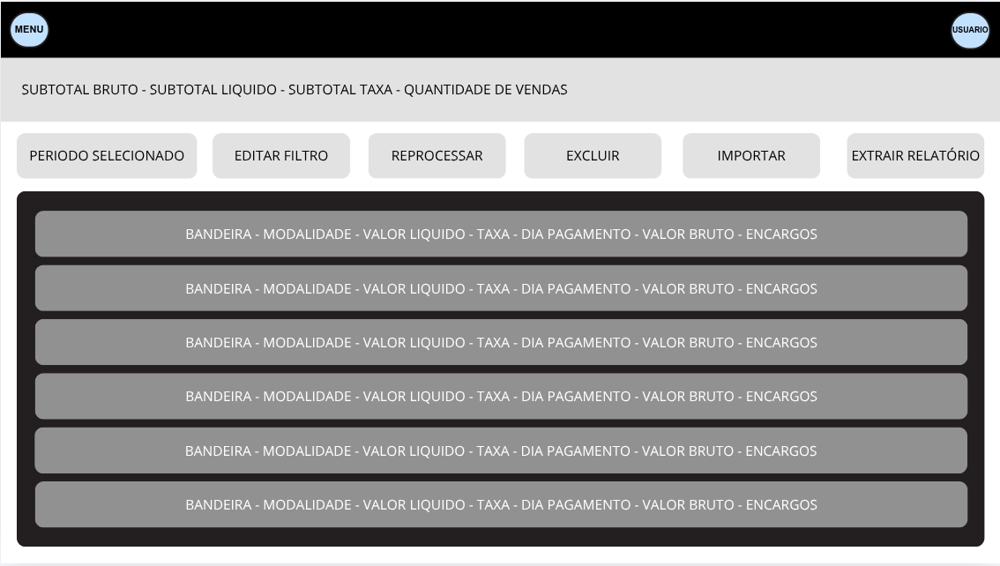

# Da modelagem ao protótipo

## Contexto do problema

Os materiais descrevem a dificuldade de consolidar vendas, taxas, previsões de recebimento e conferência bancária para lojistas. A proposta reúne proprietário, consultoria, contabilidade e administrador em um sistema comum.

## Processo anterior e processo proposto

O AS-IS mostra a obtenção de dados em portais e e-mail, filtros de período, cópia de informações financeiras e conferência em planilha.

O TO-BE resume login, menu, upload, processamento e conciliação. O diagrama original é mantido como evidência acadêmica; sua referência a cálculo automático deve ser lida junto do [contrato de dados](DADOS.md), pois o ETL atual importa taxa e previsão já preenchidas.

## Sprint 2 — Modelagem e arquitetura

Os artefatos incluem [casos de uso](diagramas/casos-de-uso.pdf), [classes UML](diagramas/classes.pdf) e [contexto C4](diagramas/contexto-c4.pdf).

| Ator planejado | Responsabilidade desejada |
| --- | --- |
| Pessoa PJ | Consultar desempenho, vendas e informações financeiras |
| Consultoria | Conferir recebimentos, validar lotes e tratar divergências |
| Contabilidade | Consultar e extrair relatórios |
| Administrador | Gerir usuários, dados e funcionamento do sistema |

Os onze casos de uso documentados abrangem login, consulta de vendas/recebimentos, relatórios, inclusão/exclusão de valores, cadastro/exclusão de contas, suporte, validação e alteração de dados. Nem todos possuem implementação no motor atual. A notação dos diagramas foi preservada; esta documentação não certifica sua conformidade formal com UML/BPMN/C4.

## Sprint 3 — Desenho no Canva

O documento inicial usa o nome ConsulCred em um campo, enquanto os materiais finais adotam ConciCred, nome utilizado neste repositório. Ele declara dez telas e apresenta cinco telas principais detalhadas.

### Login

### Menu

### Dashboard

### Recebimentos

### Vendas

Essas imagens são evidências do desenho inicial. Botões como cadastro, configurações e histórico representam a intenção de navegação e não comprovam funcionalidades implementadas.

## Sprint 4 — Alta fidelidade no Node-RED

Os documentos finais apresentam cinco telas principais e descrevem melhorias de ocupação do espaço, posicionamento da marca e organização do dashboard, com indicadores acima dos gráficos. O export inclui também suporte e consultor IA em abas separadas.

O fluxo do protótipo permite acessar o menu, importar vendas e consultar indicadores. O módulo de recebimentos demonstra ações sobre lotes gerados localmente. O endereço privado registrado no trabalho acadêmico foi substituído nos guias por `localhost`, pois aquele endereço não é uma hospedagem pública.

## Integração de IA

O relatório da disciplina de Engenharia de Prompt registra o acréscimo do chat ao dashboard, preparação de métricas em JavaScript e uso da Groq. Consulte [IA.md](IA.md) para a comparação entre o relato e o export final.

## Aprendizados registrados

Os textos do autor destacam o esforço de transformar uma ideia em fluxo navegável, organizar caminhos simples para cada perfil e lidar com novas possibilidades durante um prazo curto. A evolução proposta inclui banco relacional e integração com adquirentes, mantendo-as como próximos passos.

As capas acadêmicas usam 2025, enquanto a massa demonstrativa do código usa 2026. Esses anos foram preservados como contexto dos materiais, sem inferir datas exatas de implementação.
